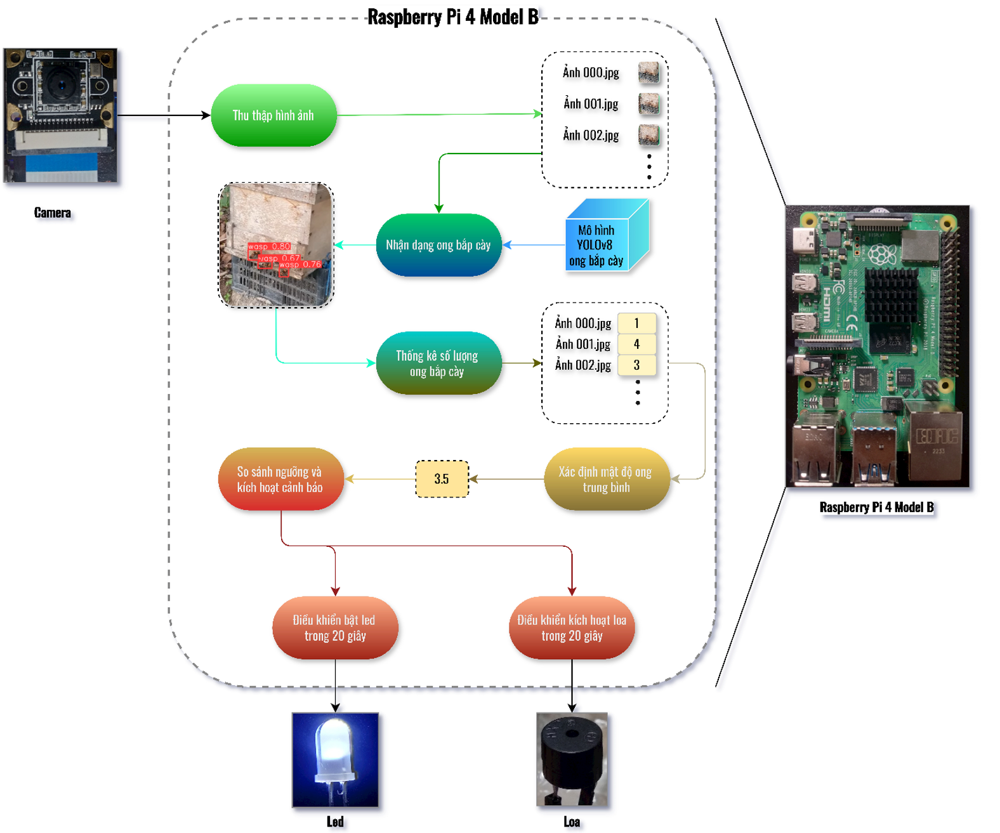
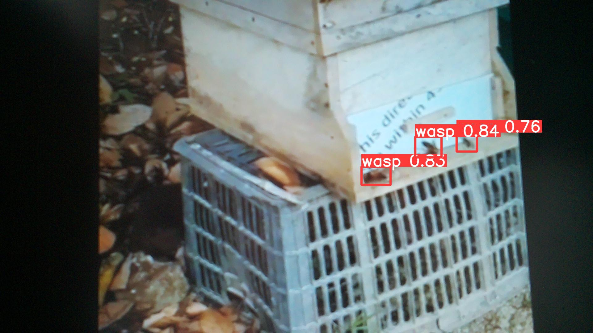
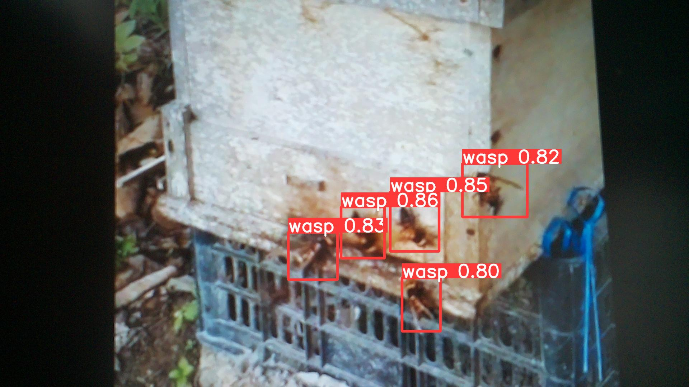
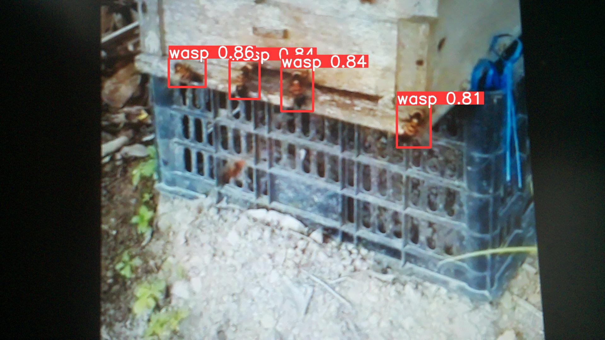

# Hornet Attack Detection System for Beehives 🐝

AI-powered embedded system for protecting beehives from hornet attacks.  
Deployed on **Raspberry Pi** with **camera integration**, **OpenCV preprocessing**, and a **real-time alert system (LED + buzzer)**.

## Features
- Real-time hornet detection using Raspberry Pi Camera.
- OpenCV preprocessing pipeline for image enhancement.
- Alert system with LED + buzzer to notify beekeepers of hornet threats.

## Tech Stack
- Python
- OpenCV
- Raspberry Pi (with Pi Camera)

## Hardware Setup
- Raspberry Pi 4 (tested)
- Raspberry Pi Camera Module
- LED + Buzzer (GPIO connected)

## Pipeline Diagram

Mô tả tổng quan luồng xử lý hornet detection từ Raspberry Pi Camera đến cảnh báo LED + Buzzer.

### Sample detection images

  
  
  

